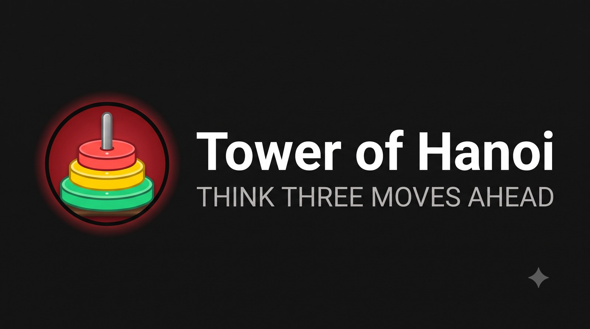
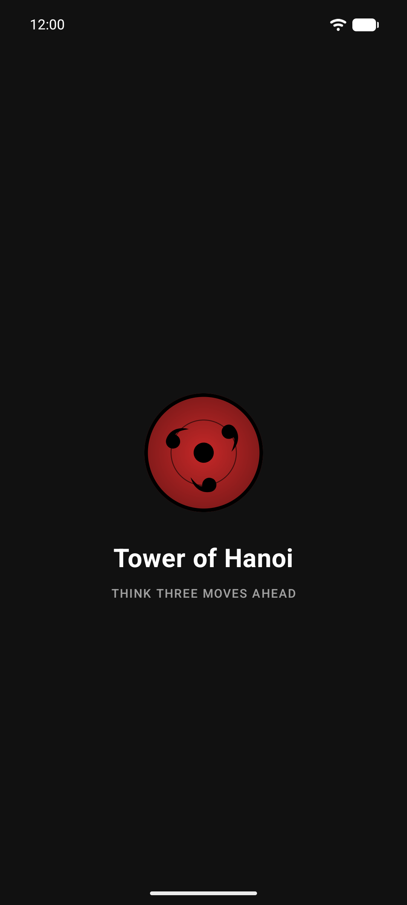
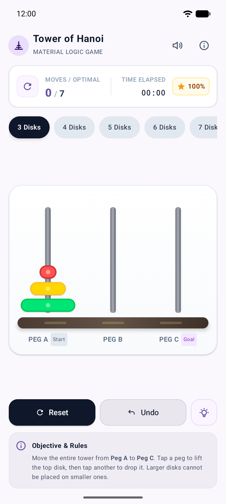
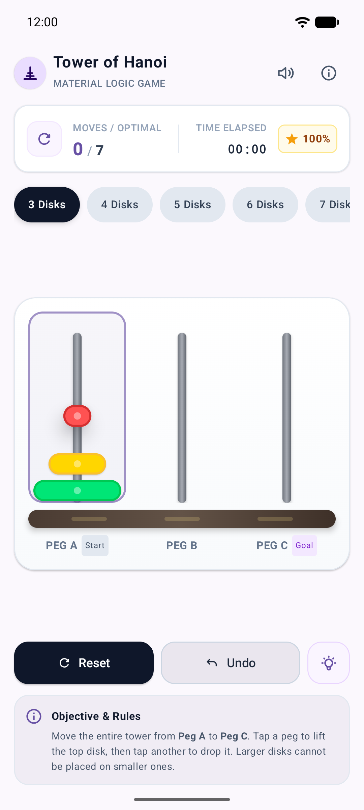
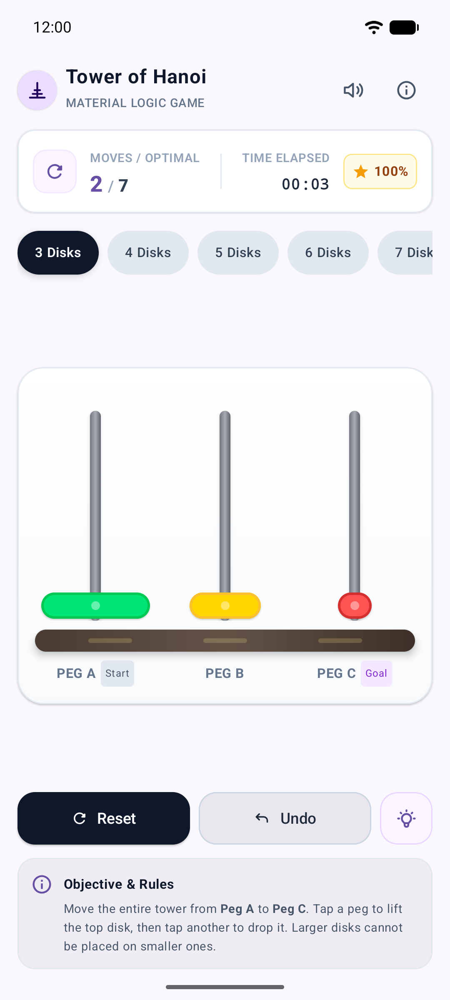
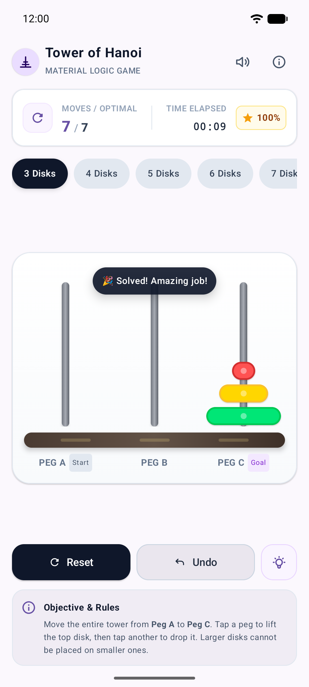
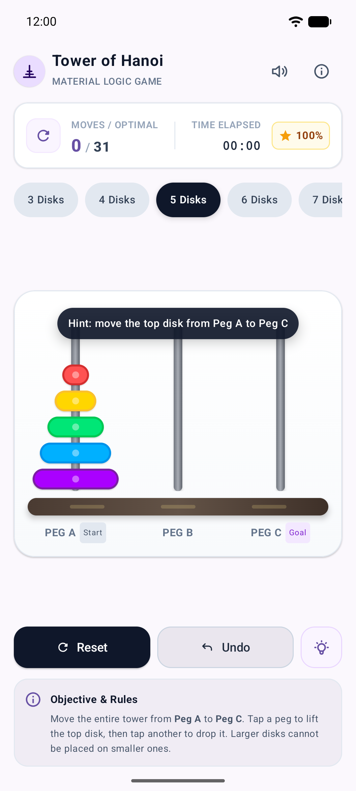

<p align="center">
  
</p>

# Tower of Hanoi

A Tower of Hanoi puzzle for Android, built with Jetpack Compose and Material 3. It opens with an animated Sharingan splash screen, then lets you play with 3 to 7 disks, with a live score, undo, and a hint that always gives the best next move.

<p align="center">
  
  
  
</p>
<p align="center">
  
  
  
</p>

## Features

- **Tap to play.** Tap a peg to lift its top disk, then tap another peg to drop it. Illegal moves are rejected with a message.
- **3 to 7 disks.** Pick a difficulty at any time; the optimal move count (2ⁿ − 1) updates to match.
- **Live scoreboard.** Shows moves vs. optimal, a timer that starts on your first move, and an efficiency score.
- **Undo** steps back through your moves.
- **Smart hint.** Works out the best next move from any position, even after detours.
- **Sharingan splash.** The Android 12+ system splash hands off to a spinning `SharinganLoader` at the same size and position, with no jump.
- **Accessible.** Pegs, buttons and messages have screen-reader descriptions.

## How to play

Move the whole tower from **Peg A** to **Peg C**:

1. Move one disk at a time.
2. Only the top disk of a peg can move.
3. A larger disk can never sit on a smaller one.

Solve it in the optimal number of moves to keep a 100% efficiency score.

## Tech stack

| | |
|---|---|
| Language | Kotlin 2.0 |
| UI | Jetpack Compose (BOM 2024.04.01), Material 3 |
| Min / target SDK | 26 / 35 |
| Build | Gradle (Kotlin DSL), AGP 8.8, version catalog |
| Tests | JUnit 4, Compose UI test, Espresso 3.7 |

## Project structure

```
app/src/main/java/com/fahim/towerofhanoi/
├── MainActivity.kt              # Entry point, edge-to-edge system bars
├── game/
│   └── HanoiState.kt            # Pure, immutable game logic: moves, undo, hint, scoring
└── ui/
    ├── TowerOfHanoiApp.kt       # Splash → game crossfade
    ├── MangekyouSharinganLoader.kt  # SharinganEye + SharinganLoader
    ├── Tomoe.kt                 # Tomoe shape geometry
    ├── splash/SplashScreen.kt
    ├── hanoi/                   # Game screen: board, scoreboard, controls, tokens, icons
    └── theme/Theme.kt
```

The game logic in `game/` has no Android dependencies. Every action returns a new `HanoiState`, so the UI just renders whatever state it is given.

## Build and run

Requires JDK 17 and the Android SDK (or Android Studio).

```bash
./gradlew :app:assembleDebug        # build the debug APK
./gradlew :app:installDebug         # install on a connected device or emulator
```

Or open the project in Android Studio and run the `app` configuration.

## Tests

```bash
./gradlew :app:testDebugUnitTest            # unit tests: game logic and UI helpers
./gradlew :app:connectedDebugAndroidTest    # UI test on a device/emulator: splash → game
```

The unit tests include a check that following the hint solves every difficulty in exactly the optimal number of moves.

## Credits

The game screen design was made with Google Stitch and rebuilt in Jetpack Compose.
